# training360-szoftverarchitekturak

1. hét

Standalone_konzolos1

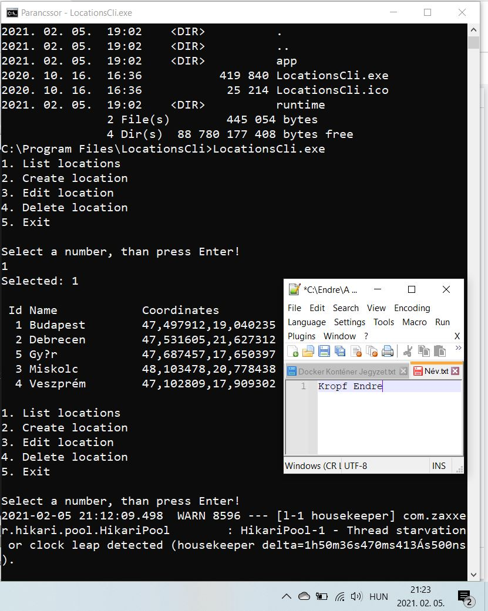

Standalone_konzolos2

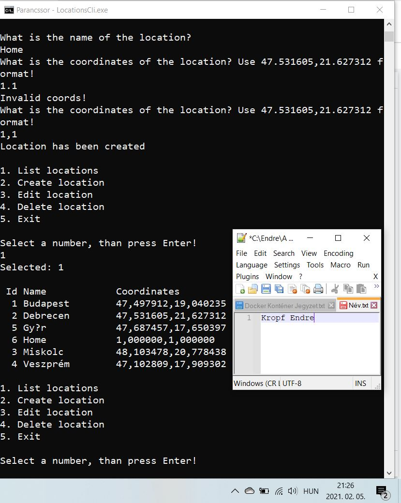

Standalone_konzolos3

Standalone_grafikus1

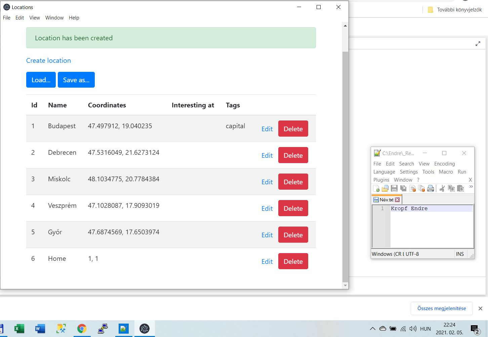

Standalone_grafikus2

Központi_adatbázis

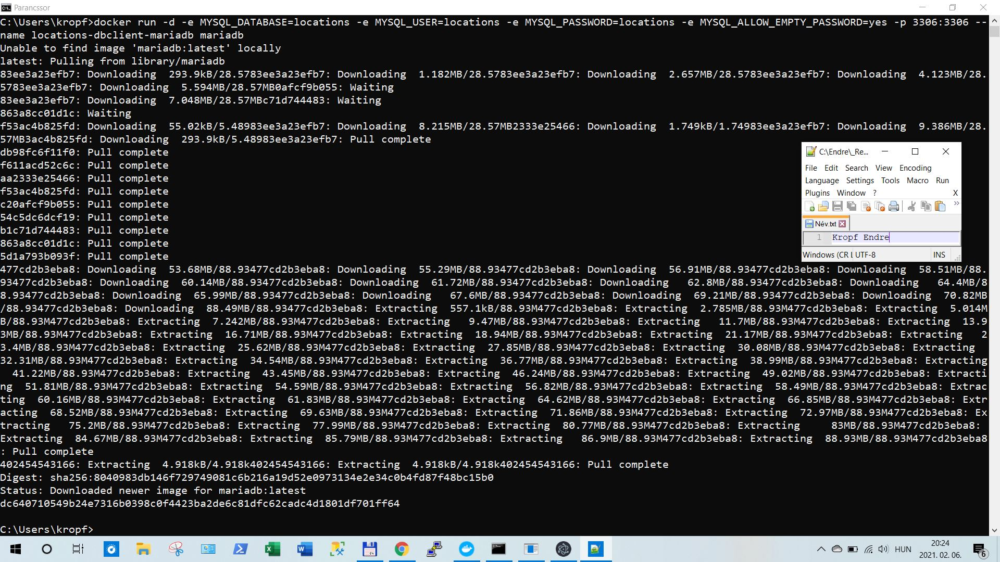

Központi_adatbázis2

SQL_konzolos

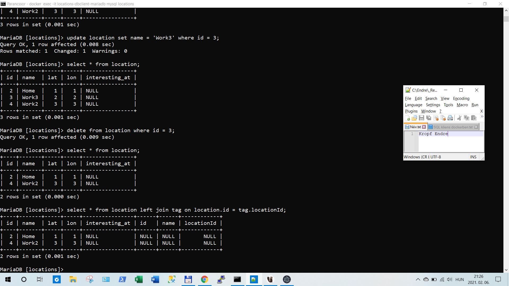

SQL_DBeaver

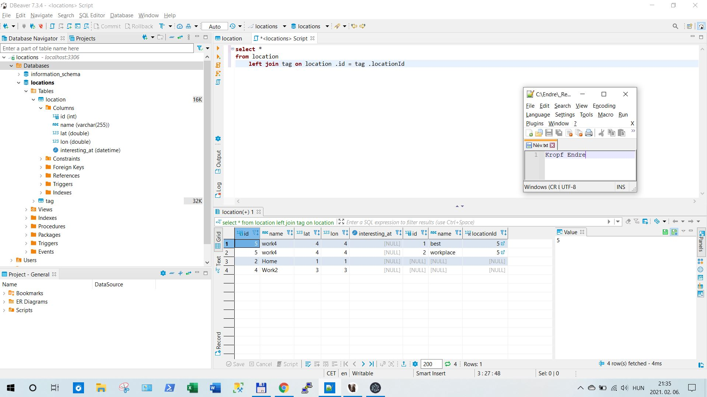

MongoDB_konzolos

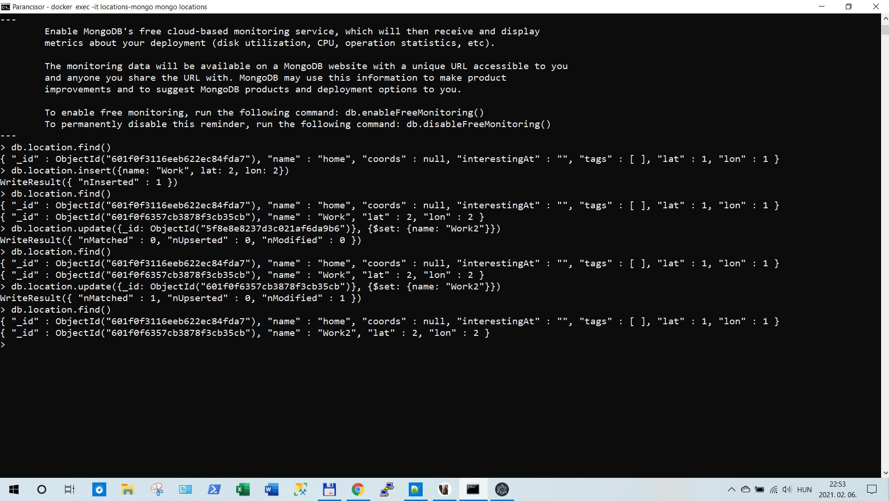

Többrétegű_alkalmazások

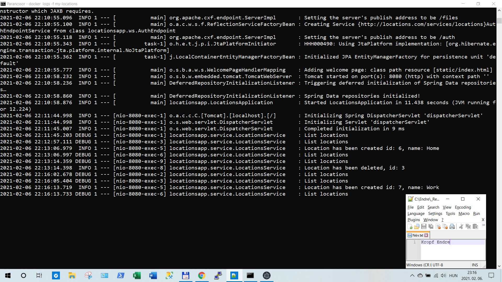

Webes_alkalmazás

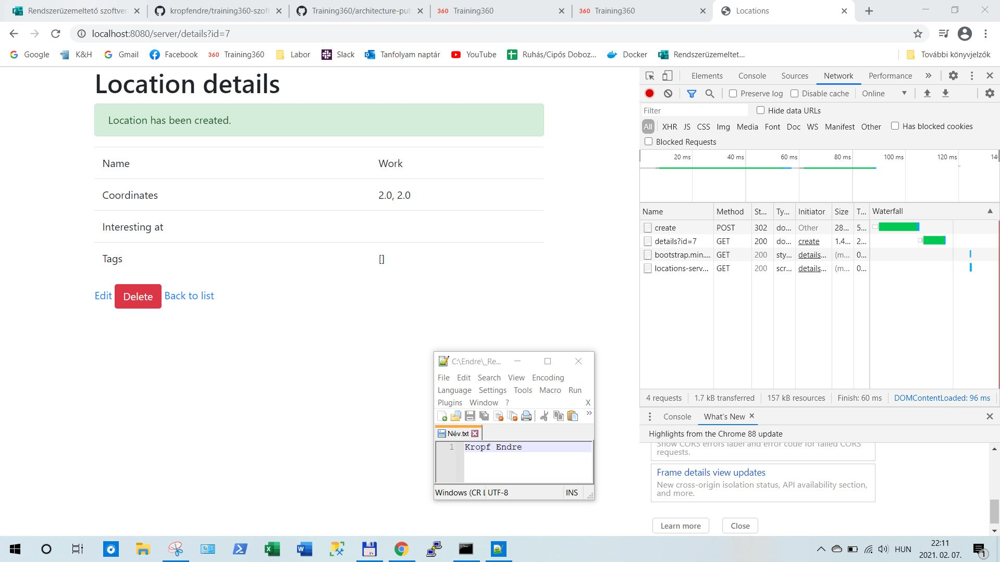

Webes_alkalmazás_parancssorból

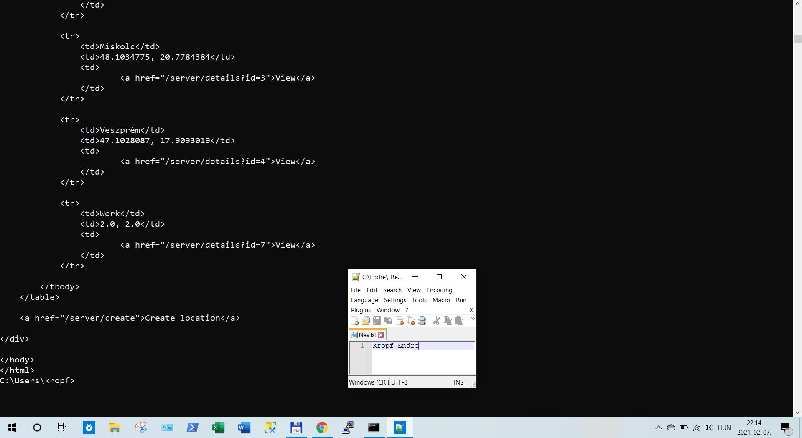

(Html_CSS

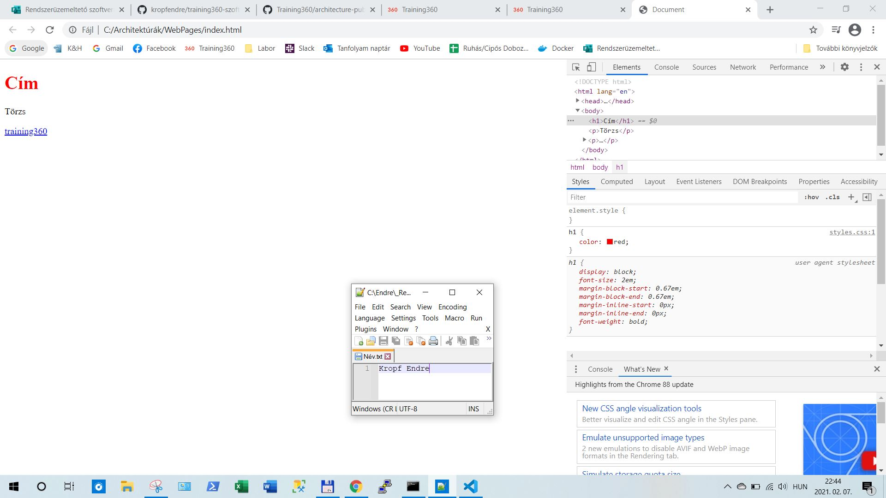

Html_CSS_VSCode

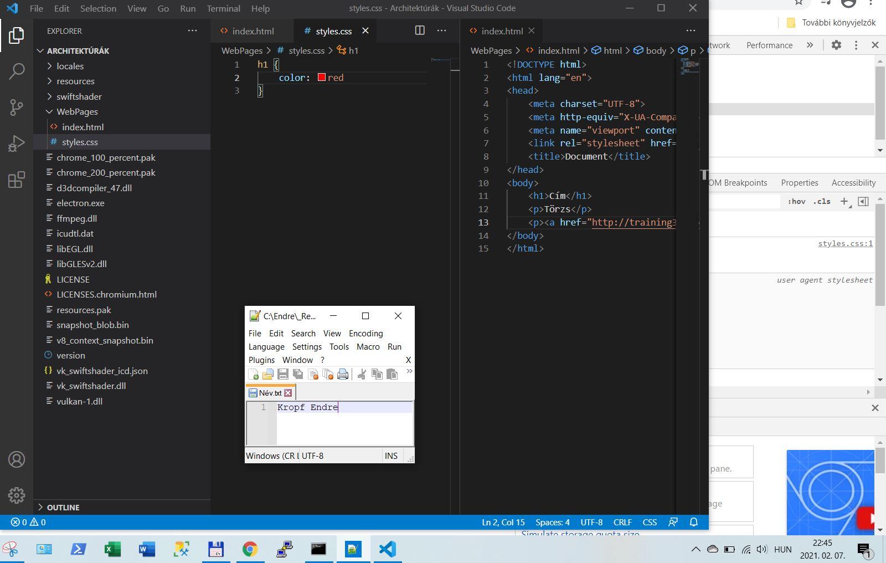

2. hét

RIA_JS

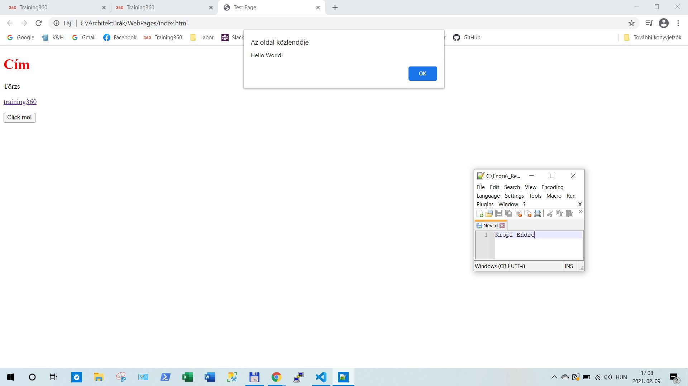

Magas_rendelkezésre_állás

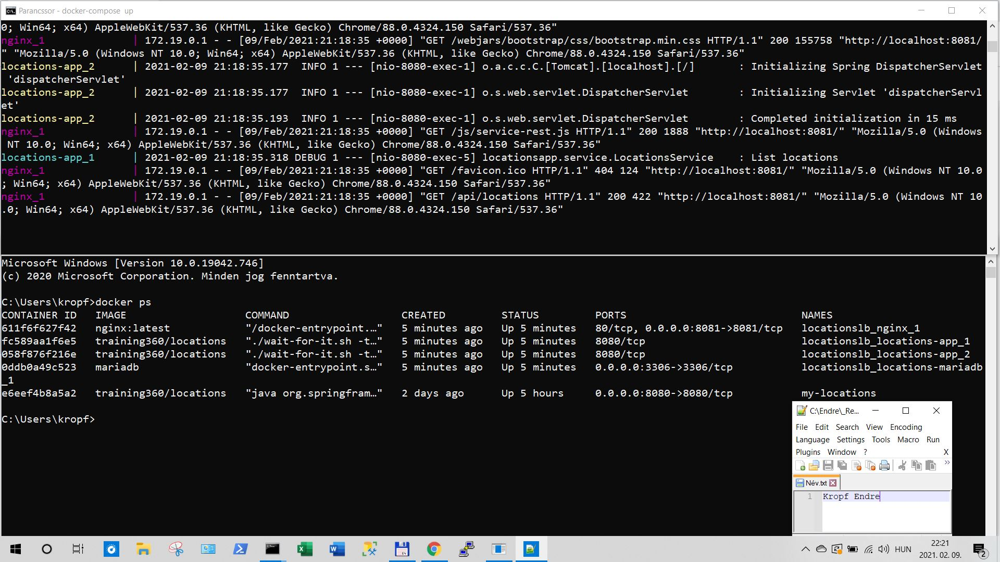

Swagger

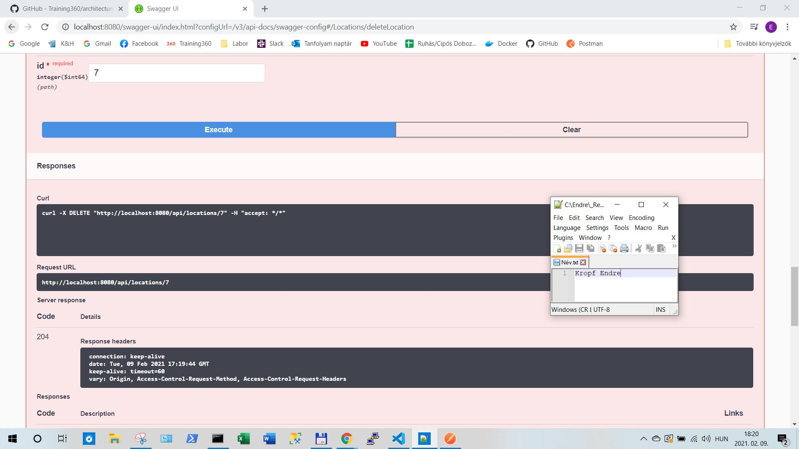

Postman

Postman2

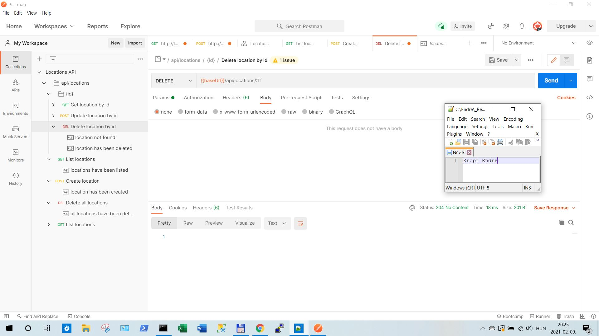
